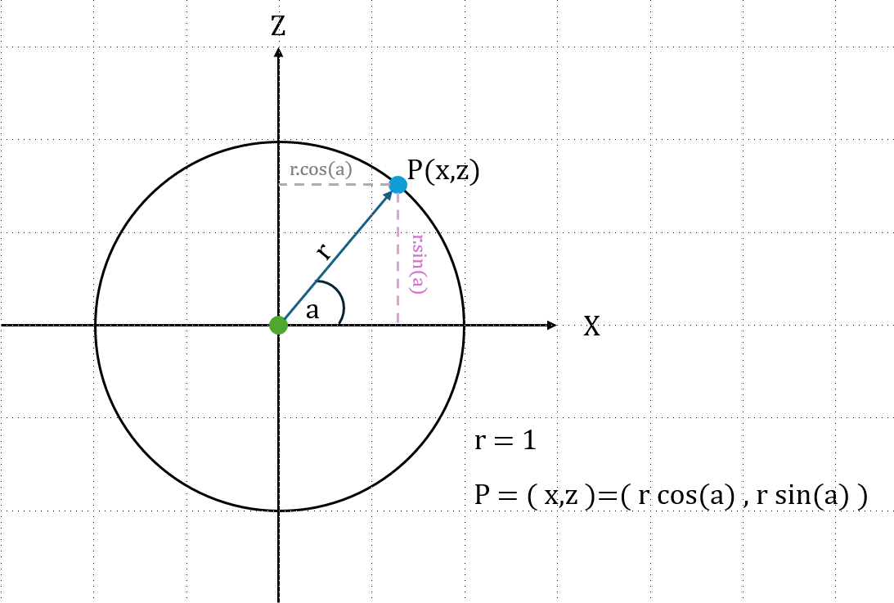

# Theoretical Concepts 📚✨

## Orbit 🌌🪐
For this project, we will focus on recreating simple orbits.  
An **orbit** is the curved path of an object around a point in space, usually around a larger body due to gravitational forces. In our project, it represents the path that planets or other objects follow around a central point, like the Sun.

## Sine Function 🌊📏

The **sine function (sin)** represents the vertical position of a point on a unit circle corresponding to a given angle.  

- The sine value is always **between -1 and 1**:  
  $|sin(x)| <= 1$
  This means the point never goes above 1 or below -1 on the vertical axis. ✅

- The sine function can also be approximated using the **Taylor series** around 0:  
$sin(x) \approx x - \frac{x^3}{3!} + \frac{x^5}{5!} - \frac{x^7}{7!}$

- In our project, the sine function helps calculate the **vertical position (z-axis)** of the orbiting point along a circular path. 🪐🔄

## Cosine Function 🌞📐

The **cosine function (cos)** represents the horizontal position of a point on a unit circle corresponding to a given angle.  

- The cosine value is always **between -1 and 1**:  
  $|cos(x)| <= 1$  
  This means the point never goes above 1 or below -1 on the horizontal axis. ✅

- The cosine function can also be approximated using the **Taylor series** around 0:  
$cos(x) \approx 1 - \frac{x^2}{2!} + \frac{x^4}{4!} - \frac{x^6}{6!}$

- In our project, the cosine function helps calculate the **horizontal position (x-axis)** of the orbiting point along a circular path. 🌌🔄
- 
## Orbital Path Visualization 🌌🪐

  

To create the orbital path, we calculate points along a circle using a finite range of angles.  
By incrementing the angle from `0` to `2π`, we can generate a **complete orbit** around the central point.  

Each point is calculated using the formula:  

`P = (x, z) = (r * cos(a), r * sin(a))`  

- Here:  
  - `r` is the radius of the orbit 🔵  
  - `a` is the current angle in radians 📐  
  - `x` represents the horizontal position (cosine) 🌞  
  - `z` represents the vertical position (sine) 🌊  

The angle `a` increases incrementally to create a smooth circular path. ✅  
Because of the properties of sine and cosine, **no matter how large the numbers are**, the absolute values of `sin(a)` and `cos(a)` **never exceed 1 or -1**.  
...
