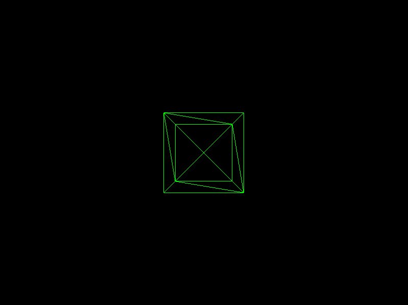
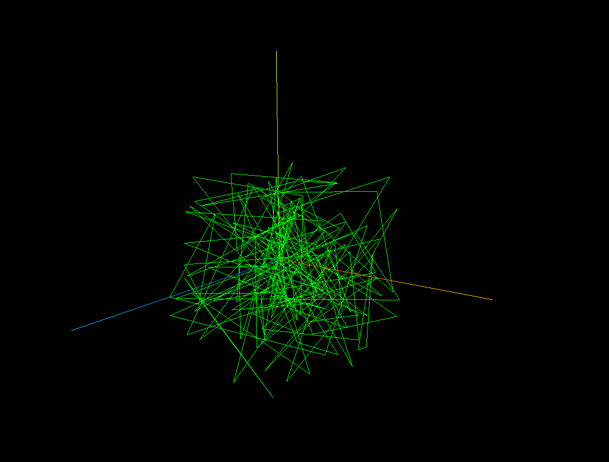
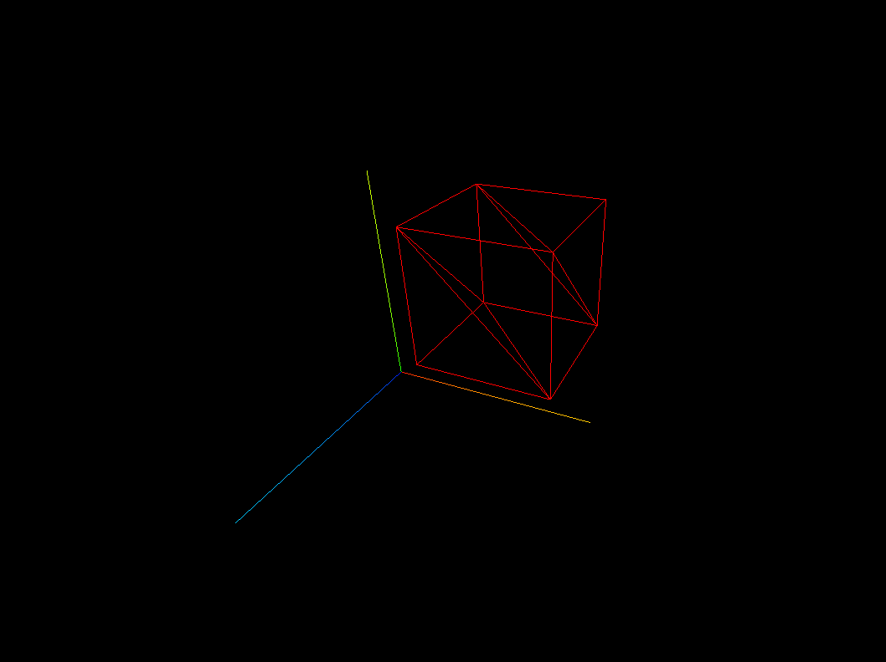

# Three.js Practice 🎨✨

This repository contains my personal practice exercises for learning **Three.js**.  
Each folder represents a different exercise, starting from basic geometry to animations and lighting.

## 📂 Contents

| Folder      | Description |
|------------|-------------|
| `01-cube` | Basic cube with camera and renderer 🟦 |
| `02-Animation` | Sequential cube animation with deltaTime and logic control 🎥 |
| `03-Camera` | Interactive camera control using cursor input, sin & cos math functions 📸 |
| `04-Fullscreen` | Responsive fullscreen mode with resize handling and pixel ratio limit 🖥️ |
| `05-Geometries` | Procedural geometry built from raw Float32Array vertex buffers ⬡ |
| `07-Float32Array` | Cube geometry built from raw Float32Array vertex coordinates ⬡ |
| `08-Lil-GUI` | Real-time parameter tweaking with lil-gui debug controls 🎛 |
| `09-Float32Array` | Interactive scene with objects controlled via lil-gui 🎛 |

*(More exercises will be added over time! 🚀)*

---

## 🧰 Technologies Used

- JavaScript (JS) 💻  
- Three.js 🌐  
- Vite ⚡  
- VS Code 🖊️

---

## 🔧 How to Run

1. Clone this repository:
git clone https://github.com/EmilianoAyalaCanul/threejs-practice.git

2. Navigate to the exercise folder:
threejs-practice/01-cube

3. Install dependencies:
npm install

4. Run the project:
npm run dev

5. Open the URL shown in the terminal

---

## 📸 Screenshots

### Exercise 01: Cube 🟩

### Exercise 02: Animation 🎥

### Exercise 03: Camera 📸

### Exercise 04: Fullscreen 🖥️

### Exercise 05: Geometries ⬡

### Exercise 07: Float32Array ⬡

### Exercise 08: Lil Gui 🎛

### Exercise 09 Debug UI 🎛

..
---

